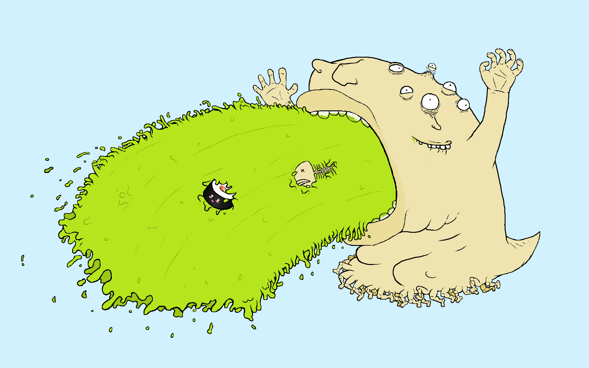
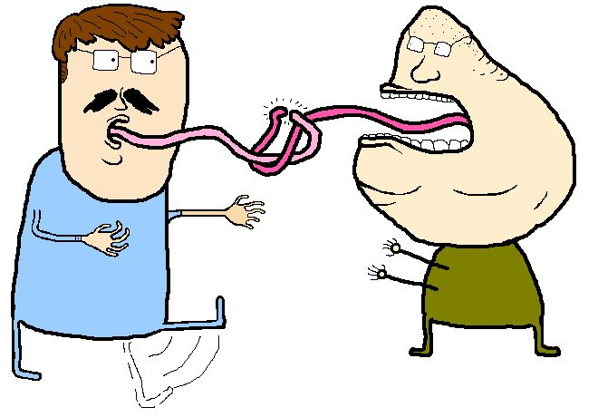
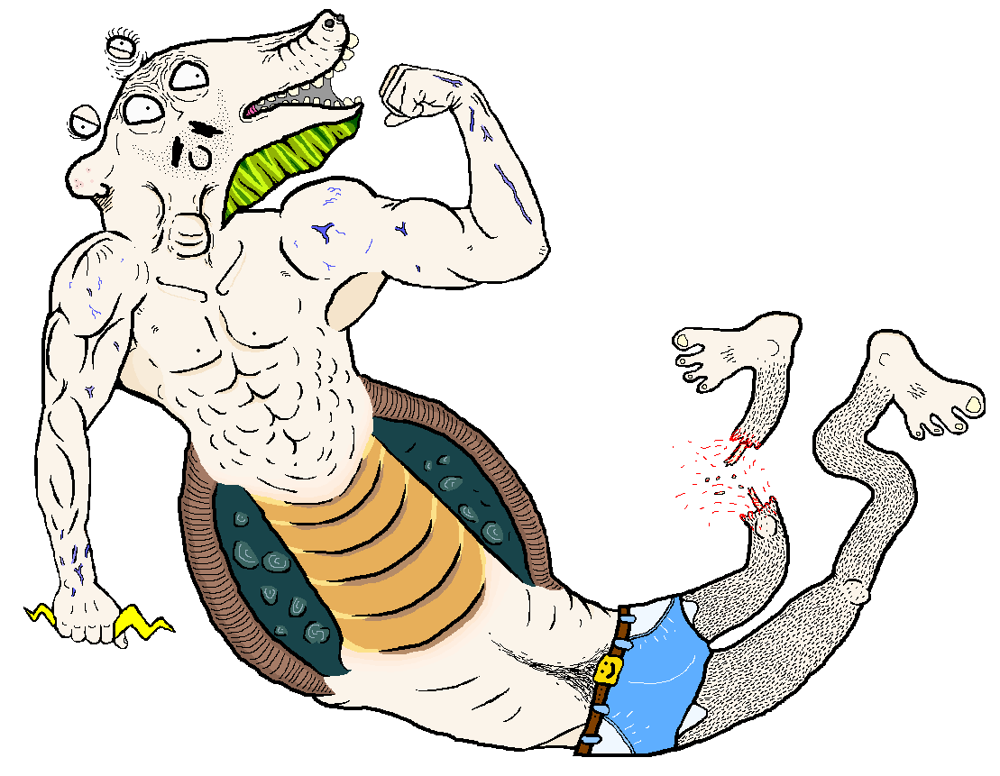
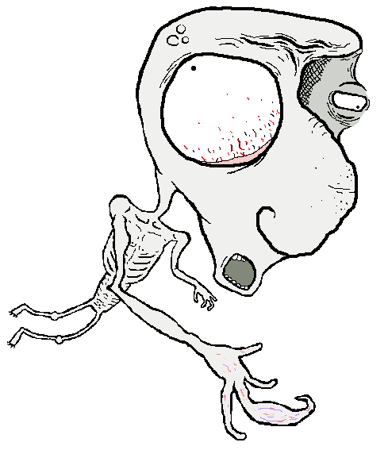
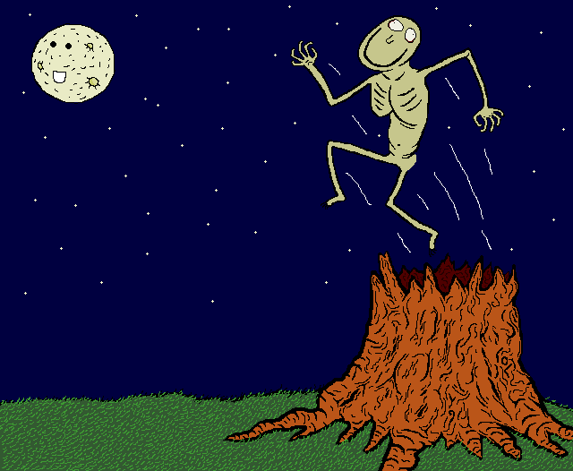

About a decade ago I was working in a job where I had considerable downtime in front of a computer. Naturally, I decided that the best way to spend my time was to draw things in MS Paint. In this time, my colleagues and I would shitpost via email to each other. A mate asked me to draw something for his girlfriends birthday. I ignored his request and drew this instead

I had a job where I worked a night shift back in 2008-2009, it was pretty quiet a lot of the time so I used to pass the time by making weird art in mspaint.

